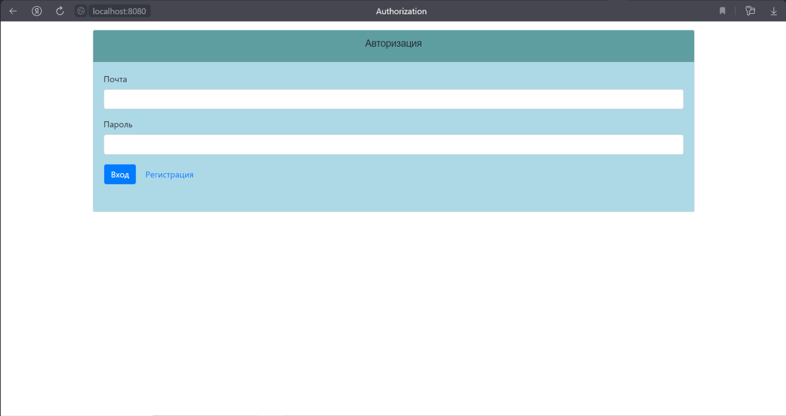
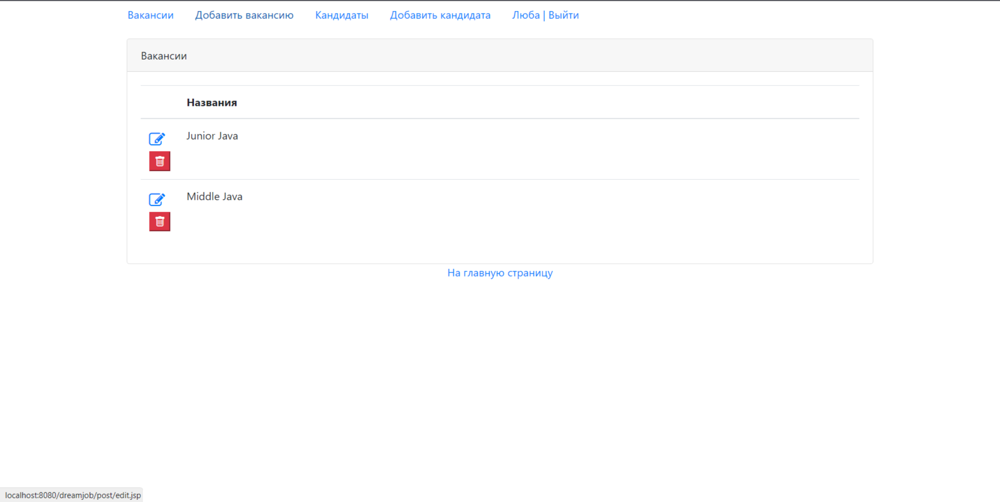
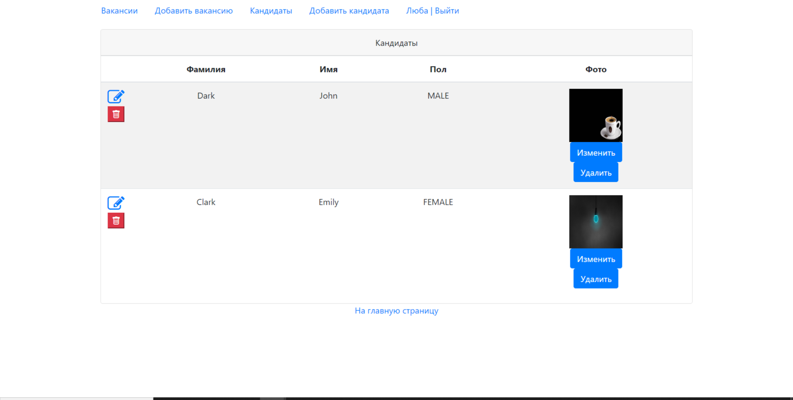
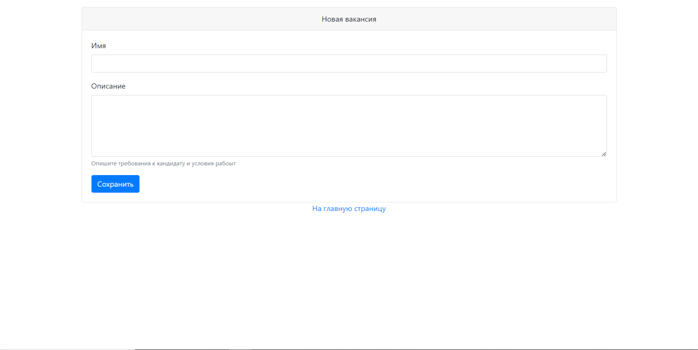
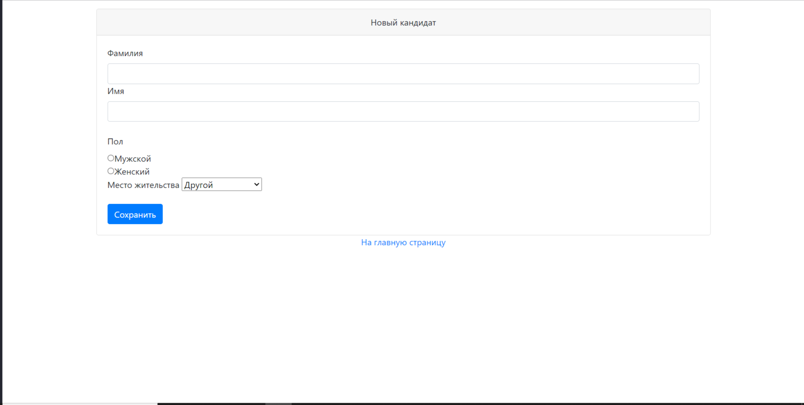
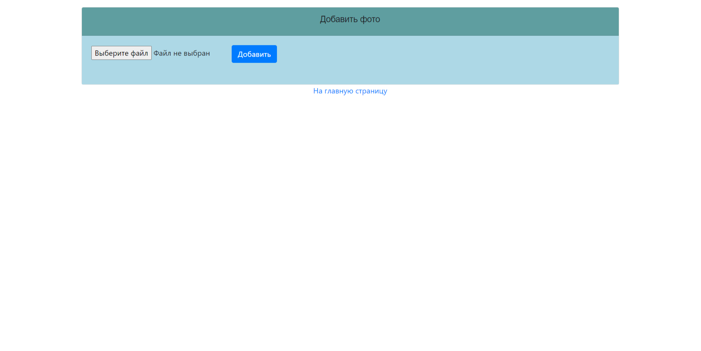

This repository presents the "job exchange" application. There are two types of users: candidates and HRs. Candidates
may post resumes. HRs may post vacancies about work. Candidates may apply for a vacancy. HR may invite a candidate to a
vacancy.

To use the application, you must log in. Authorization page:

Then you can view vacancies and candidates:

Also you can add a vacancy or a candidate:

It is possible add photo to candidate:
